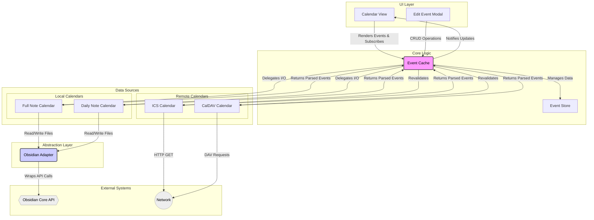

[](https://youfoundjk.github.io/Time-Analyser-Full-Calender/)

# Full Calendar Plugin - Developer Documentation

Obsidian Full Calendar's goal is to give users a robust and feature-ful calendar view into their Obsidian Vault. In addition to displaying and modifying events stored in note frontmatter and daily note bulleted lists, it can also read events from the Internet in CalDAV and ICS format.

Obsidian Full Calendar takes its name from [FullCalendar](https://github.com/fullcalendar/fullcalendar), a "Full-sized drag & drop event calendar in JavaScript." This plugin uses FullCalendar as its calendar view. While the naming can be ambiguous, this document will always refer to the FullCalendar view library without any spaces, or as `fullcalendar.io`. The plugin will be referred to either as "the plugin", "Full Calendar" with a space, or "Obsidian Full Calendar".

As of now, the plugin supports events from the following sources and formats:

-   Frontmatter of notes in the open Obsidian Vault.
-   Bullet list items in Daily Notes generated by the [core Daily Notes](https://help.obsidian.md/Plugins/Daily+notes) or [Periodic Notes](https://github.com/liamcain/obsidian-periodic-notes) plugins.
-   ICS files publicly accessible at a URL.
-   CalDAV servers authenticated with HTTP basic authentication.

Much of the code of Full Calendar exists to deal with the normalization of these formats so they can be handled by the view layer without worrying about what sources different events are actually from.

Below is a birds-eye view of the different components of the plugin, and the interactions between them.

```ascii

                              ┌──────────────────────────────────┐
                              │ UI Layer (React Modals, view.ts) │
                              └──────────────────────────────────┘
                                   │      ▲               │
    (User creates/edits event)     │      │ (Pub/Sub      │   (User drags/resizes event)
                      "CRUD Ops"   │      │   Update)     │ "Modify Event"
                                   ▼      │               ▼
.--------------------------.  ┌──────────────────────────────────┐      .──────────────────.
| LEGEND                   |  │      Core Layer: EventCache      │ ◄─── |  ChronoAnalyser  |
| ──►  Direct Call         |  │     (Single Source of Truth)     │ ~~~> |  (sub-project)   |
| <~>  Event/Hook          |  └──────────────────────────────────┘      '──────────────────'
| ◄──► Internal R/W        |              ▲      │
| ..> Pub/Sub Notification |              │      │                     
'--------------------------'              │      ▼                  
                              ┌───────────┴────────────────────────┐
                              │  Data Sources Layer (Calendar.ts)  │
                              └────────────────────────────────────┘
                                            │
                    ┌───────────────────────┴───────────────────────┐
                    │                                               │
        ┌───────────────────────┐                       ┌───────────────────────┐
        │  Editable Calendars   │                       │   Remote Calendars    │
        │ (FullNote, DailyNote) │                       │  (ICSCalendar, etc.)  │
        └───────────────────────┘                       └───────────────────────┘
            │             ▲                                  │             ▲
  "Delegate │             │ "File Events"            "Re-    │             │ "Get Events"
    Write"  │             │ (on file change)        validate"│             │
            ▼             │                                  ▼             │
  ┌──────────────────────────────────┐                  ┌───────────────────────┐
  │ Abstraction: ObsidianAdapter.ts  │                  │   The Internet*       │
  └──────────────────────────────────┘                  └───────────────────────┘
            │             ▲                             .---------------------------.
  "File I/O"│             │ <~ "on('changed', ...)"     | DATA FLOWS                |  
            ▼             │                             |                           |
  ┌──────────────────────────────────┐                  | ┌──> User-Initiated Write |
  │   Obsidian Vault APIs*           │                  | ├──> Filesystem Sync      |
  └──────────────────────────────────┘                  | └──> Remote Sync          |
                                                        '---------------------------'
 * Components with an asterisk are not part of the plugin's code.
```


## Table of Contents

1.  [Architecture Overview](#architecture-overview)
    *   [High-Level Diagram](#high-level-diagram)
2.  [Core Components In-Depth](#core-components-in-depth)
    *   [The Plugin Entry Point (`main.ts`)](#the-plugin-entry-point-maints)
    *   [EventCache: The Central Nervous System](#eventcache-the-central-nervous-system)
    *   [EventStore: The In-Memory Database](#eventstore-the-in-memory-database)
    *   [The Calendar System](#the-calendar-system)
    *   [ObsidianAdapter: A Decoupling Layer](#obsidianadapter-a-decoupling-layer)
    *   [The UI Layer (`view.ts`, `event_modal.ts`)](#the-ui-layer-viewts-event_modalts)
3.  [Data Flow and State Management](#data-flow-and-state-management)
    *   [Flow 1: User-Initiated Change (e.g., Drag-and-Drop)](#flow-1-user-initiated-change-eg-drag-and-drop)
    *   [Flow 2: Filesystem-Initiated Change (e.g., External Edit)](#flow-2-filesystem-initiated-change-eg-external-edit)
4.  [Key Data Structures](#key-data-structures)
    *   [`OFCEvent`](#ofcevent)
    *   [`EventLocation`](#eventlocation)
5.  [Key Developer Hooks](#key-developer-hooks)
    *   [Adding a New Calendar Type](#adding-a-new-calendar-type)
    *   [Subscribing to Cache Updates](#subscribing-to-cache-updates)
6.  [Development and Tooling](#development-and-tooling)

## Architecture Overview

The Full Calendar plugin is built on a modular, decoupled architecture designed for testability and extensibility. At its heart is the `EventCache`, which acts as a single source of truth for the UI and orchestrates interactions between different calendar sources and the Obsidian vault.

### High-Level Diagram

This diagram illustrates the primary components and the flow of data and control between them.



## Core Components In-Depth

### The Plugin Entry Point (`main.ts`)

`FullCalendarPlugin` is the main class that Obsidian loads. Its primary responsibilities are:
*   **Initialization**: Sets up the `EventCache` with a `CalendarInitializerMap`. This map is a factory that creates the appropriate `Calendar` object based on user settings.
*   **View Registration**: Registers `CalendarView` for the main workspace and sidebar, and `AnalysisView`.
*   **Lifecycle Management**: Loads settings (`onload`), populates the cache, and registers listeners for Obsidian vault events (`on('changed')`, `on('rename')`, `on('delete')`). These listeners are crucial for keeping the cache in sync with the filesystem.
*   **Command Registration**: Adds commands to the palette, such as creating a new event or resetting the cache.

### EventCache: The Central Nervous System

> `core/EventCache.ts` is the most critical component. It is the single source of truth for all event data displayed in the UI.

*   **Responsibilities**:
    *   **State Management**: Holds the master list of all calendar sources and their events in its internal `EventStore`.
    *   **I/O Orchestration**: It *does not* perform file I/O or network requests directly. Instead, it delegates these tasks to the appropriate `Calendar` subclass.
    *   **CRUD Operations**: Provides a public API for the UI to `addEvent`, `deleteEvent`, and `updateEventWithId`. These methods coordinate changes in the `EventStore` and trigger persistence via the `Calendar` objects.
    *   **Pub/Sub Hub**: Implements an `on('update', callback)` method. The `CalendarView` subscribes to this to receive notifications when events are added, removed, or changed, ensuring the UI is always in sync.
    *   **Remote Revalidation**: Manages periodic fetching of remote calendars (`ICSCalendar`, `CalDAVCalendar`) to keep data fresh.

### EventStore: The In-Memory Database

> `core/EventStore.ts` is an efficient in-memory data store used by `EventCache`.

*   **Responsibilities**:
    *   **Primary Index**: Stores all events in a `Map` keyed by a unique event ID.
    *   **Secondary Indexes**: Maintains `OneToMany` relationships to allow for fast lookups of events by `calendarId` and by file `path`. This prevents costly iteration when finding all events in a specific file or calendar.
    *   **Atomicity**: Provides atomic `add` and `delete` operations that update all indexes simultaneously, ensuring data consistency within the store.

### The Calendar System

> Located in `calendars/`, this system uses a clear inheritance model to handle different event sources.

1.  **`Calendar` (Abstract)**: The base class defining the common interface for all calendars (`id`, `name`, `type`, `getEvents`).
2.  **`RemoteCalendar` (Abstract)**: Inherits from `Calendar`. Adds a `revalidate()` method for fetching updates from a network source.
    *   **Implementations**: `ICSCalendar`, `CalDAVCalendar`.
3.  **`EditableCalendar` (Abstract)**: Inherits from `Calendar`. Represents calendars whose source is the local Obsidian vault. It adds a powerful interface for file manipulation.
    *   **Key Methods**: `createEvent`, `deleteEvent`, `modifyEvent`, `getEventsInFile`.
    *   **Implementations**:
        *   `FullNoteCalendar`: Each event is a separate note with frontmatter.
        *   `DailyNoteCalendar`: Events are list items under a specific heading in a daily note.

This design is highly extensible. Adding a new source (e.g., Google Calendar, Toodledo) would involve creating a new class that implements one of these abstract interfaces.

### ObsidianAdapter: A Decoupling Layer

`ObsidianAdapter.ts` is a crucial architectural pattern. It wraps the Obsidian API (`app.vault`, `app.fileManager`, `app.metadataCache`) in a clean, promise-based interface (`ObsidianInterface`).

*   **Benefits**:
    *   **Testability**: Allows `EditableCalendar` classes to be unit-tested by mocking `ObsidianInterface` instead of needing a full Obsidian environment.
    *   **Decoupling**: The core logic of the calendars is not directly tied to the specifics of the `app` object, making the code cleaner and easier to reason about.
    *   **Centralized Logic**: Provides a single place for complex Obsidian interactions, like the `rewrite` method which ensures a file is read just before being modified.

### The UI Layer (`view.ts`, `event_modal.ts`)

*   **`CalendarView` (`ui/view.ts`)**: An `ItemView` that hosts the FullCalendar.io instance.
    *   **Role**: Renders the calendar, translates `OFCEvent` objects from the cache into `EventInput` objects for FullCalendar (using `ui/interop.ts`), and wires up user interactions (clicks, drags).
    *   **Data Sync**: Subscribes to `EventCache` updates and efficiently applies changes to the FullCalendar instance (adding, removing, or updating events) without a full re-render.
*   **React Modals (`ui/event_modal.ts`, `ui/components/EditEvent.tsx`)**:
    *   **Role**: Provides the user interface for creating and editing events.
    *   **Interaction**: The `EditEvent` component is a controlled form. On submit, it calls methods on the `EventCache` (`addEvent` or `updateEventWithId`) to persist the changes. It **does not** interact with `Calendar` objects or the filesystem directly.

## Data Flow and State Management

Understanding the data flow is key to debugging and extending the plugin.

### Flow 1: User-Initiated Change (e.g., Drag-and-Drop)

1.  **UI**: The user drags an event in the `CalendarView`. FullCalendar.io's `eventDrop` callback is triggered.
2.  **`CalendarView`**: The callback is handled. It calls `plugin.cache.updateEventWithId()`, passing the new event details.
3.  **`EventCache`**:
    a. It retrieves the `EditableCalendar` and `EventLocation` for the event from its `EventStore`.
    b. It calls `calendar.modifyEvent()`, delegating the persistence task. A crucial part of this call is a callback function that `EventCache` provides to `modifyEvent`.
4.  **`EditableCalendar`**:
    a. It receives the new event data and the location update callback.
    b. **Before** writing to disk, it calls the `updateCacheWithLocation` callback. This is critical to prevent race conditions. The callback updates the event's location in the `EventStore` in memory.
    c. It then uses the `ObsidianAdapter` to perform the file I/O (e.g., `rewrite` the note's frontmatter or rename the file).
5.  **`EventCache`**: After the `modifyEvent` promise resolves, it notifies all subscribers (like `CalendarView`) via `updateViews()`, ensuring any other open calendar views reflect the change.

### Flow 2: Filesystem-Initiated Change (e.g., External Edit)

1.  **Obsidian**: A user edits a note's frontmatter in the standard editor. Obsidian fires a `metadataCache.on('changed', ...)` event.
2.  **`main.ts`**: The listener for this event is triggered, calling `plugin.cache.fileUpdated(file)`.
3.  **`EventCache`**:
    a. It determines which, if any, `EditableCalendar`s are responsible for the updated file.
    b. For each relevant calendar, it calls `calendar.getEventsInFile(file)` to parse the new, updated event data from the file.
    c. It compares the new events with the old events for that file (retrieved from `EventStore`).
    d. If they have changed, it removes all old event IDs for that file from the `EventStore` and adds the new events.
    e. It calls `updateViews()` with the list of removed IDs and new event entries.
4.  **`CalendarView`**: The update callback receives the payload and tells FullCalendar to remove the old events and add the new ones.

## Key Data Structures

### `OFCEvent`

Defined in `types/schema.ts` using `zod`, `OFCEvent` is the **canonical internal representation** of an event. All calendar sources must parse their native data into this format. It's a discriminated union that handles single, recurring, and rrule-based events.

```typescript
// A simplified representation
export type OFCEvent = Common & Time & EventType;

type Common = {
  title: string;
  id?: string;
};

type Time = { allDay: boolean; startTime?: string; endTime?: string; };

type EventType =
  | { type: 'single'; date: string; endDate?: string; completed?: boolean | string | null; }
  | { type: 'recurring'; daysOfWeek: ('U'|'M'|'T'|'W'|'R'|'F'|'S')[]; startRecur?: string; endRecur?: string; }
  | { type: 'rrule', rrule: string; startDate: string; skipDates: string[]};
```

### `EventLocation`

This simple but vital type links an event in the cache to its physical source in the vault.

```typescript
export type EventLocation = {
  file: { path: string };
  lineNumber: number | undefined; // Used by DailyNoteCalendar
};
```

## Key Developer Hooks

### Adding a New Calendar Type

To add support for a new event source (e.g., a new web service):

1.  **Create the Calendar Class**: In `src/calendars/`, create `MyNewCalendar.ts`. It should extend either `EditableCalendar` or `RemoteCalendar`.
2.  **Implement the Interface**: Implement all required abstract methods. For a remote calendar, this would be `getEvents` and `revalidate`. For an editable one, it would be `createEvent`, `modifyEvent`, etc. Use the `ObsidianAdapter` for any vault I/O.
3.  **Update Initializer Map**: In `src/main.ts`, add your new calendar type to the `CalendarInitializerMap` in the `EventCache` constructor. This tells the cache how to instantiate your calendar from settings.
    ```typescript
    // in main.ts
    this.cache = new EventCache({
        //... other calendars
        mynewtype: info => info.type === 'mynewtype' ? new MyNewCalendar(...) : null,
    });
    ```
4.  **Update Settings UI**:
    *   In `src/types/calendar_settings.ts`, add your type to the `calendarOptionsSchema` Zod object.
    *   In `src/ui/settings.tsx`, add your new type to the dropdown in `addCalendarButton`.
    *   In `src/ui/components/AddCalendarSource.tsx`, add the form fields required to configure your new calendar.

### Subscribing to Cache Updates

If you build a new UI component that needs to display event data, you should subscribe to the `EventCache`.

```typescript
// In your view's onOpen() or component's useEffect
const callback = this.plugin.cache.on('update', payload => {
    if (payload.type === 'events') {
        // Handle payload.toAdd and payload.toRemove
    } else if (payload.type === 'calendar') {
        // Handle a full calendar source being replaced
    } else if (payload.type === 'resync') {
        // Re-fetch all events from the cache and re-render
    }
});

// In your view's onunload() or component's cleanup function
this.plugin.cache.off('update', callback);
```

## Development and Tooling

*   **Language**: TypeScript
*   **UI Framework**: React for modals and complex settings panes.
*   **Data Validation**: Zod (`types/schema.ts`) is used for robust parsing and validation of event data, which significantly reduces runtime errors.
*   **Calendar Engine**: [FullCalendar.io](https://fullcalendar.io/) is the core library used for rendering the calendar view.
*   **Testing**: The project uses Jest for unit testing. The `ObsidianAdapter` is key to making components like `FullNoteCalendar` testable. To run tests, use the appropriate npm script.