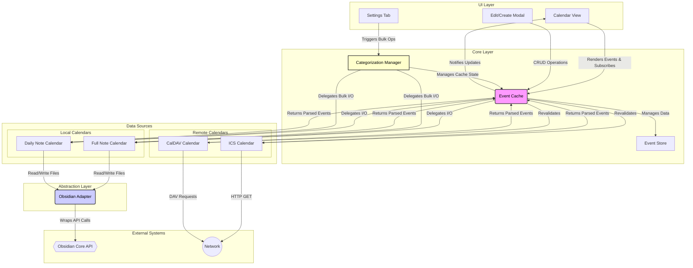

[](https://youfoundjk.github.io/Time-Analyser-Full-Calender/)

# Full Calendar Plugin - Developer Documentation

Obsidian Full Calendar's goal is to give users a robust and feature-ful calendar view into their Obsidian Vault. In addition to displaying and modifying events stored in note frontmatter and daily note bulleted lists, it can also read events from the Internet in CalDAV and ICS format.

Obsidian Full Calendar takes its name from [FullCalendar](https://github.com/fullcalendar/fullcalendar), a "Full-sized drag & drop event calendar in JavaScript." This plugin uses FullCalendar as its view layer. While the naming can be ambiguous, this document will always refer to the FullCalendar view library as `FullCalendar.io`. The plugin will be referred to as "the plugin", "Full Calendar", or "Obsidian Full Calendar".
 
As of now, the plugin supports events from the following sources and formats:

-   Frontmatter of notes in the open Obsidian Vault.
-   Bulleted list items in Daily Notes generated by the [core Daily Notes](https://help.obsidian.md/Plugins/Daily+notes) or [Periodic Notes](https://github.com/liamcain/obsidian-periodic-notes) plugins.
-   ICS files publicly accessible at a URL.
-   CalDAV servers authenticated with HTTP basic authentication.

Much of the code of Full Calendar exists to deal with the normalization of these formats so they can be handled by the view layer without worrying about what sources different events are actually from.

Below is a birds-eye view of the different components of the plugin, and the interactions between them.

```ascii

                            ┌──────────────────────────────────┐
                            │ UI Layer (React Modals, view.ts) │
                            └──────────────────────────────────┘
                                 │      ▲               │
  (User creates/edits event)     │      │ (Pub/Sub      │   (User drags/resizes event)
                    "CRUD Ops"   │      │   Update)     │ "Modify Event"
                                 ▼      │               ▼
.--------------------------.  ┌──────────────────────────────────┐      .──────────────────.
| LEGEND                   |  │      Core Layer: EventCache      │ ◄─── |  ChronoAnalyser  |
| ──►  Direct Call         |  │     (Single Source of Truth)     │ ~~~> |  (sub-project)   |
| ◄──► Internal R/W        |  └──────────────────────────────────┘      '──────────────────'
| ◄──  Service Call        |            ▲          │                            ▲
| ..> Pub/Sub Notification |            │          │                            │
'--------------------------'            │          ▼                            │
                            ┌───────────┴────────────────────────┐ ┌────────────────────────┐
                            │  Data Sources Layer (Calendar.ts)  │ │   Core Service Layer   │
                            └────────────────────────────────────┘ └────────────────────────┘
                                          │                              │        │
                  ┌───────────────────────┴───────────────────┐          │        ▼
                  │                                           │          │ ┌──────────────────────┐
      ┌───────────────────────┐                   ┌───────────────────┐  │ │ CategorizationManager│
      │  Editable Calendars   │                   │ Remote Calendars  │  └►│   (Bulk Operations)  │
      │ (FullNote, DailyNote) │                   │ (ICS, CalDAV)     │    └──────────────────────┘
      └───────────────────────┘                   └───────────────────┘
          │             ▲                              │             ▲
"Delegate │             │ "File Events"        "Re-    │             │ "Get Events"
  Write"  │             │ (on file change)    validate"│             │
          ▼             │                              ▼             │
┌──────────────────────────────────┐              ┌───────────────────────┐
│ Abstraction: ObsidianAdapter.ts  │              │   The Internet*       │
└──────────────────────────────────┘              └───────────────────────┘
          │             ▲                         .---------------------------.
"File I/O"│             │ <~ "on('changed', ...)" | DATA FLOWS                |
          ▼             │                         |                           |
┌──────────────────────────────────┐              | ┌──> User-Initiated Write |
│   Obsidian Vault APIs*           │              | ├──> Filesystem Sync      |
└──────────────────────────────────┘              | └──> Remote Sync          |
                                                  '---------------------------'
 * Components with an asterisk are not part of the plugin's code.
```

## Table of Contents

1.  [Architecture Overview](#architecture-overview)
    *   [High-Level Diagram](#high-level-diagram)
2.  [Core Components In-Depth](#core-components-in-depth)
    *   [The Plugin Entry Point (`main.ts`)](#the-plugin-entry-point-maints)
    *   [EventCache: The Central Nervous System](#eventcache-the-central-nervous-system)
    *   [EventStore: The In-Memory Database](#eventstore-the-in-memory-database)
    *   [CategorizationManager: The Bulk Operations Service](#categorizationmanager-the-bulk-operations-service)
    *   [The Calendar System](#the-calendar-system)
    *   [ObsidianAdapter: A Decoupling Layer](#obsidianadapter-a-decoupling-layer)
    *   [The UI Layer (`view.ts`, `event_modal.ts`)](#the-ui-layer-viewts-event_modalts)
3.  [Key Concepts](#key-concepts)
    *   [Timezone Handling](#timezone-handling)
    *   [Category Parsing](#category-parsing)
4.  [Data Flow and State Management](#data-flow-and-state-management)
    *   [Flow 1: User-Initiated Change (e.g., Drag-and-Drop)](#flow-1-user-initiated-change-eg-drag-and-drop)
    *   [Flow 2: Filesystem-Initiated Change (e.g., External Edit)](#flow-2-filesystem-initiated-change-eg-external-edit)
5.  [Key Data Structures](#key-data-structures)
    *   [`OFCEvent`](#ofcevent)
    *   [`EventLocation`](#eventlocation)
6.  [Key Developer Hooks](#key-developer-hooks)
    *   [Adding a New Calendar Type](#adding-a-new-calendar-type)
    *   [Subscribing to Cache Updates](#subscribing-to-cache-updates)
7.  [Development and Tooling](#development-and-tooling)

## Architecture Overview

The Full Calendar plugin is built on a modular, decoupled architecture designed for testability and extensibility. At its heart is the `EventCache`, which acts as a single source of truth for the UI and orchestrates interactions between different calendar sources and the Obsidian vault. It is supported by modular services like the `CategorizationManager` for handling complex, vault-wide operations.

### High-Level Diagram

This diagram illustrates the primary components and the flow of data and control between them.



## Core Components In-Depth

### The Plugin Entry Point (`main.ts`)

`FullCalendarPlugin` is the main class that Obsidian loads. Its primary responsibilities are:
*   **Initialization**: Sets up core services like the `EventCache` and `CategorizationManager`. It provides the `EventCache` with a `CalendarInitializerMap`, a factory for creating `Calendar` objects from user settings.
*   **View Registration**: Registers `CalendarView` for the main workspace and sidebar.
*   **Lifecycle Management**: Loads settings (`onload`), populates the cache, and registers listeners for Obsidian vault events (`on('changed')`, `on('rename')`, `on('delete')`). These listeners are crucial for keeping the cache in sync with the filesystem.
*   **Command Registration**: Adds commands to the palette, such as creating a new event or resetting the cache.

### EventCache: The Central Nervous System

> `core/EventCache.ts` is the most critical component. It is the single source of truth for all event data displayed in the UI.

*   **Responsibilities**:
    *   **State Management**: Holds the master list of all calendar sources and their events in its internal `EventStore`.
    *   **I/O Orchestration**: It *does not* perform file I/O or network requests directly. Instead, it delegates these tasks to the appropriate `Calendar` subclass.
    *   **CRUD Operations**: Provides a public API for the UI to `addEvent`, `deleteEvent`, and `updateEventWithId`.
    *   **Pub/Sub Hub**: Implements an `on('update', callback)` method. The `CalendarView` subscribes to this to receive notifications when events are added, removed, or changed.
    *   **State Flagging**: Exposes an `isBulkUpdating` flag that can be set by external services (like `CategorizationManager`) to temporarily pause filesystem-triggered updates, preventing race conditions.
    *   **Remote Revalidation**: Manages periodic, throttled fetching of remote calendars.

### EventStore: The In-Memory Database

> `core/EventStore.ts` is an efficient in-memory data store used by `EventCache`.

*   **Responsibilities**:
    *   **Primary Index**: Stores all events in a `Map` keyed by a unique event ID.
    *   **Secondary Indexes**: Maintains `OneToMany` relationships to allow for fast lookups of events by `calendarId` and by file `path`. This prevents costly iteration when finding all events in a specific file.
    *   **Atomicity**: Provides atomic `add` and `delete` operations that update all indexes simultaneously.

### CategorizationManager: The Bulk Operations Service

> `core/CategorizationManager.ts` is a dedicated service for handling complex, vault-wide modifications.

*   **Responsibilities**:
    *   **Orchestration**: Contains the business logic for the "Category Coloring" feature's bulk updates (e.g., `bulkUpdateCategories`, `bulkRemoveCategories`).
    *   **Control Flow**: Manages the `EventCache.isBulkUpdating` flag to ensure the cache remains stable during its operations. It triggers a final cache reset upon completion.
    *   **Abstraction**: Interacts with the abstract `EditableCalendar` interface, delegating the actual file modification work to the specific calendar implementations. It does not know or care about frontmatter vs. inline text.

### The Calendar System

> Located in `calendars/`, this system uses a clear inheritance model to handle different event sources.

1.  **`Calendar` (Abstract)**: The base class defining the common interface for all calendars (`id`, `name`, `getEvents`).
2.  **`RemoteCalendar` (Abstract)**: Inherits from `Calendar`. Adds a `revalidate()` method for fetching updates.
    *   **Implementations**: `ICSCalendar`, `CalDAVCalendar`.
3.  **`EditableCalendar` (Abstract)**: Inherits from `Calendar`. Represents calendars whose source is the local Obsidian vault. It adds a powerful interface for file manipulation.
    *   **Key Methods**: `createEvent`, `deleteEvent`, `modifyEvent`, `getEventsInFile`, and the bulk-operation hooks `bulkAddCategories` and `bulkRemoveCategories`.
    *   **Implementations**:
        *   `FullNoteCalendar`: Each event is a separate note with frontmatter.
        *   `DailyNoteCalendar`: Events are list items under a specific heading in a daily note.

### ObsidianAdapter: A Decoupling Layer

`ObsidianAdapter.ts` wraps the Obsidian API (`app.vault`, `app.fileManager`, etc.) in a clean, promise-based `ObsidianInterface`.

*   **Benefits**:
    *   **Testability**: Allows `EditableCalendar` classes to be unit-tested by mocking `ObsidianInterface` instead of needing a full Obsidian environment.
    *   **Decoupling**: The core logic of the calendars is not directly tied to the specifics of the `app` object.
    *   **Centralized Logic**: Provides a single place for complex Obsidian interactions, like the `rewrite` method.

### The UI Layer (`view.ts`, `event_modal.ts`)

*   **`CalendarView` (`ui/view.ts`)**: An `ItemView` that hosts the FullCalendar.io instance. It renders the calendar, translates `OFCEvent` objects into `EventInput` objects for the view (using `ui/interop.ts`), and wires up user interactions (clicks, drags) to the `EventCache`.
*   **React Modals (`ui/event_modal.ts`, `ui/components/EditEvent.tsx`)**: The UI for creating and editing events. On submit, it calls methods on the `EventCache`. It **does not** interact with `Calendar` objects or the filesystem directly.

## Key Concepts

### Timezone Handling

> `core/Timezone.ts` provides the core logic for all time-based conversions.

The plugin operates on a simple principle: all event times are converted to a single "Display Timezone" before being rendered.
*   **`convertEvent`**: This is the single source of truth for converting an `OFCEvent` object from a source timezone to a target timezone. It uses the `luxon` library to handle DST and other complexities correctly.
*   **Local Calendars**: `FullNoteCalendar` and `DailyNoteCalendar` (in "strict" mode) stamp events with a timezone upon creation and modification.
*   **Remote Calendars**: `ICSCalendar` and `CalDAVCalendar` parse timezone information from the event data itself.
*   **On Load**: `manageTimezone` runs once on plugin load to intelligently set the display timezone and handle changes in the system's timezone.

### Category Parsing

> `core/categoryParser.ts` provides pure utility functions for the Category Coloring feature.

The feature operates on a `Category - Title` format.
*   **`parseTitle`**: Takes a full string and splits it at the first ` - ` delimiter, returning `{ category, title }`.
*   **`constructTitle`**: Takes a category and title and joins them into the full string.
*   **Conditional Logic**: The *decision* to use these functions is made within each `Calendar` class's parsing/serialization logic, controlled by the `enableCategoryColoring` setting. This ensures the feature is opt-in and does not affect users who have it disabled.

## Data Flow and State Management

### Flow 1: User-Initiated Change (e.g., Drag-and-Drop)

1.  **UI**: User drags an event in `CalendarView`. FullCalendar.io's `eventDrop` callback is triggered.
2.  **`CalendarView`**: Calls `plugin.cache.updateEventWithId()`.
3.  **`EventCache`**: Retrieves the `EditableCalendar` and `EventLocation` from `EventStore` and calls `calendar.modifyEvent()`, delegating the persistence task. It provides a callback to `modifyEvent` to update the in-memory `EventStore` *before* the file write.
4.  **`EditableCalendar`**: Calls the cache's update callback, then uses the `ObsidianAdapter` to perform the file I/O.
5.  **`EventCache`**: After the `modifyEvent` promise resolves, it notifies all subscribers (`CalendarView`) to update the UI.

### Flow 2: Filesystem-Initiated Change (e.g., External Edit)

1.  **Obsidian**: A user edits a note. Obsidian fires a `metadataCache.on('changed', ...)` event.
2.  **`main.ts`**: The listener calls `plugin.cache.fileUpdated(file)`.
3.  **`EventCache`**:
    a. Checks if `isBulkUpdating` is `true`. If so, it ignores the event.
    b. Otherwise, it identifies the relevant `EditableCalendar` for the file path.
    c. It calls `calendar.getEventsInFile(file)` to get the new event data.
    d. It compares the new data to the old data in `EventStore`.
    e. If different, it atomically updates `EventStore` (removes old, adds new).
    f. It calls `updateViews()` with a payload of removed IDs and new event entries.
4.  **`CalendarView`**: The update callback receives the payload and tells FullCalendar.io to efficiently remove/add the specific events.

## Key Data Structures

### `OFCEvent`

Defined in `types/schema.ts` using `zod`, `OFCEvent` is the **canonical internal representation** of an event. It includes the optional `category` property.

```typescript
// A simplified representation
export type OFCEvent = Common & Time & EventType;

type Common = {
  title: string;      // The CLEAN title, without category prefix.
  category?: string; // The parsed category, if it exists.
  id?: string;
  timezone?: string;
};
// ... (Time and EventType definitions)
```

### `EventLocation`

This simple but vital type links an event in the cache to its physical source in the vault.

```typescript
export type EventLocation = {
  file: { path: string };
  lineNumber: number | undefined; // Used by DailyNoteCalendar
};
```

## Key Developer Hooks

### Adding a New Calendar Type

To add support for a new event source (e.g., a new web service):

1.  **Create the Calendar Class**: In `src/calendars/`, create `MyNewCalendar.ts`. It should extend `EditableCalendar` or `RemoteCalendar`.
2.  **Implement the Interface**: Implement all required abstract methods. If it's an `EditableCalendar`, you must also implement `bulkAddCategories` and `bulkRemoveCategories` for compatibility with the settings UI.
3.  **Update Initializer Map**: In `src/main.ts`, add your new calendar type to the `CalendarInitializerMap`.
4.  **Update Settings UI**: Update `zod` schemas in `calendar_settings.ts` and the React components in `settings.tsx` and `AddCalendarSource.tsx` to handle the new type.

### Subscribing to Cache Updates

If you build a new UI component that needs to display event data, you should subscribe to the `EventCache`.

```typescript
// In your view's onOpen() or component's useEffect
const callback = this.plugin.cache.on('update', payload => {
    if (payload.type === 'events') {
        // Handle payload.toAdd and payload.toRemove
    } else if (payload.type === 'resync') {
        // Re-fetch all events from the cache and re-render
    }
});

// In your view's onunload() or component's cleanup function
this.plugin.cache.off('update', callback);
```

## Development and Tooling

*   **Language**: TypeScript
*   **UI Framework**: React for modals and complex settings panes.
*   **Data Validation**: Zod (`types/schema.ts`) is used for robust parsing and validation of event data.
*   **Calendar Engine**: [FullCalendar.io](https://fullcalendar.io/) is the core library used for rendering the calendar view.
*   **Testing**: The project uses Jest for unit testing. The `ObsidianAdapter` is key to making components testable. To run tests, use `npm test`.